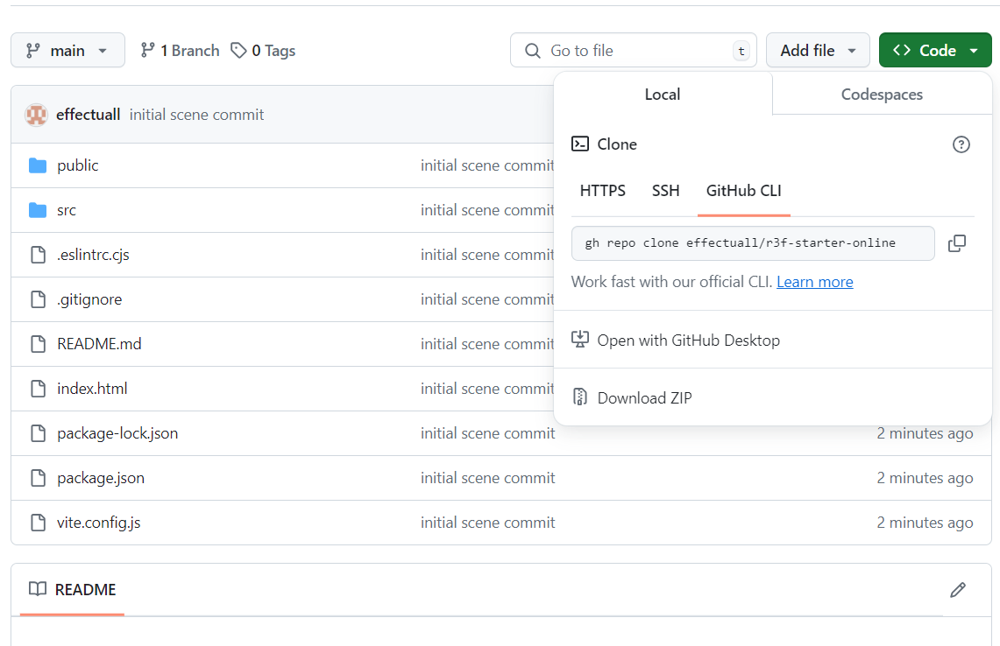

# React three starter template

To clone the repository using HTTPS, under "HTTPS", click & copy the code

## Open system cammand prompt
go to project folder >>cd project
## In order to run the below command git needs to be installed
run >>git clone https://github.com/effectuall/r3f-starter-online.git
## this creates a folder "r3f-starter-online" in the folder project
run >>cd r3f-starter-online 
(or navigate to this folder in visual code and run the commands in your terminal)
    >> npm install
    >> code . 

the final command opens visual code 

## 

git init
git commit -m "first commit"
git branch -M main
git remote add origin https://github.com/effectuall/r3f-starter-online.git
git push -u origin main